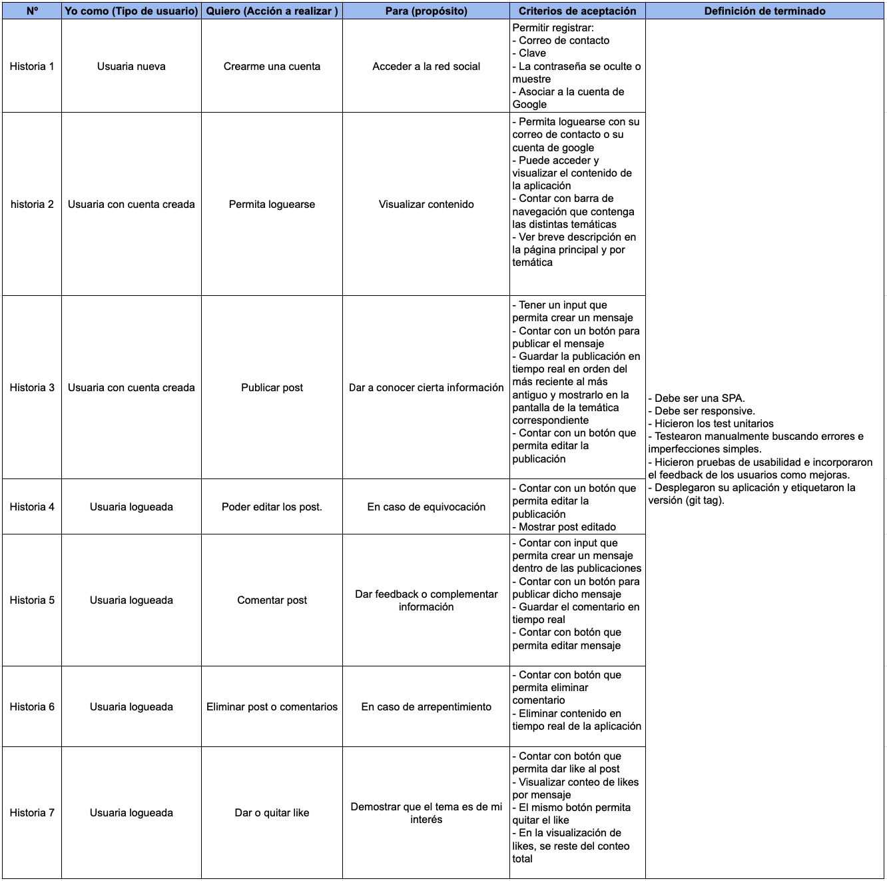
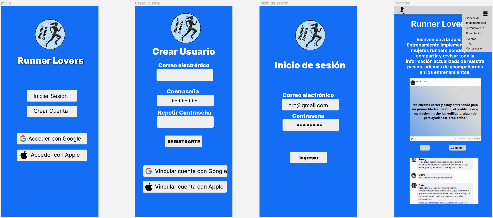

# Runner Lovers: Red Social para mujeres runners. 

## Índice

* [1. Resumen del proyecto](#1-resumen-del-proyecto)
* [2. Investigación UX](#2-investigación-UX)
* [3. Historias de usuario](#3-historias-de-usuario)
* [4. Prototipo de baja](#4-prototipo-de-baja)
* [5. Prototipo de alta](#5-prototipo-de-alta)
* [6. Testeos de usabilidad](#6-testeos-de-usabilidad)

## 1. Resumen del proyecto

Runner Lovers es una red social para mujeres que se están iniciando en el mundo del
running y mujeres que comparten la misma pasión. Para de esta manera apoyarse,
y acompañarse en entrenamientos y así protegerse entre ellas, compartir eventos
de este deporte, tips de alimentación, calzado, rutinas de entrenamientos, implementos
deportivos, rutas más seguras, entre otros.

## 2. Investigación UX

A través de un formulario se consultó por los temas de interés principales a mujeres
que practican este deporte, o que les gustaría ser parte de esta comunidad. Además de
conocer actividades que les gustaría realizar en esta red social, como por ejemplo crear
post, comentarlos, darles likes, entre otros. Para de esta manera compartir diferentes tips
de información relacionada.

## 3. Historias de usuario

## 4. Prototipo de baja

## 5. Prototipo de alta

## 6. Testeos de usabilidad

Realizamos testeos de usabilidad a distintas posibles usuaria de la aplicación, recibiendo 
diferentes feedbacks que nos permitieron mejorar las funciones de nuestra aplicación, además 
de mejoras visuales en cuanto al diseño. Logrando así el producto final responsive en óptimas condiciones, cumpliendo con todos nuestros objetivos propuestos.

